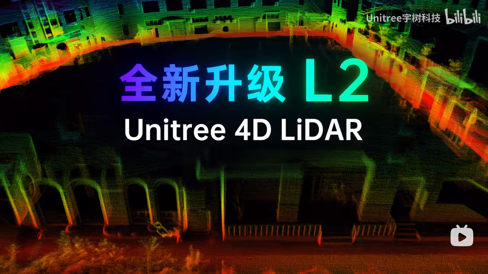

# point_lio_unilidar

## 1. Introduction

This repository adapts the state-of-the-art lidar inertial odometry algorithm, `Point-LIO`, for use with our lidar products:
- `Unitree Lidar L1`
- `Unitree Lidar L2`

Both `L1` and `L2` possess these features:
- large field of view (360° × 90°)
- non-repetitive scanning
- low cost
- suitable for applications in low-speed mobile robots

If you want to learn more about our lidar products, you can refer to the official website for details.
- <https://m.unitree.com/en/LiDAR/>


`Point-LIO` is a robust and high-bandwidth lidar inertial odometry (LIO) with the capability to provide accurate, high-frequency odometry and reliable mapping under severe vibrations and aggressive motions. If you need further information about the `Point-LIO` algorithm, you can refer to their official website and paper:
- <https://github.com/hku-mars/Point-LIO>
- [Point‐LIO: Robust High‐Bandwidth Light Detection and Ranging Inertial Odometry](https://onlinelibrary.wiley.com/doi/epdf/10.1002/aisy.202200459)

## 2. Video Demos

### 2.1 L1 Lidar

[](https://oss-global-cdn.unitree.com/static/c0bd0ac7d1e147e7a7eaf909f1fc214f.mp4 "SLAM based on Unitree 4D LiDAR L1")

### 2.2 L2 Lidar
 
[](https://www.bilibili.com/video/BV1XVUVYHEHR "SLAM based on Unitree 4D LiDAR L2")

[YouTube](https://youtu.be/juAfGrg2xBg?si=IVTWM9shEmHsKKJ_)


## 3. Prerequisites

### 3.1 Ubuntu and ROS
We tested our code on Ubuntu20.04 with [ROS noetic](http://wiki.ros.org/noetic/Installation/Ubuntu). Ubuntu18.04 and lower versions have problems of environments to support the Point-LIO, try to avoid using Point-LIO in those systems. 

You can refer to the official website to install ROS noetic:
- <http://wiki.ros.org/noetic/Installation/Ubuntu>

Additional ROS package is required:
```
sudo apt-get install ros-xxx-pcl-conversions
```

### 3.2 Eigen
Following the official [Eigen installation](eigen.tuxfamily.org/index.php?title=Main_Page), or directly install Eigen by:
```
sudo apt-get install libeigen3-dev
```

### 3.3 unilidar_sdk

For using lidar `L1`, you should download and build [unilidar_sdk](https://github.com/unitreerobotics/unilidar_sdk) follwing these steps:

```
git clone https://github.com/unitreerobotics/unilidar_sdk.git

cd unilidar_sdk/unitree_lidar_ros

catkin_make
```

### 3.4 unilidar_sdk2

For using lidar `L2`, you should download and build [unilidar_sdk2](https://github.com/unitreerobotics/unilidar_sdk2) follwing these steps:

```
git clone https://github.com/unitreerobotics/unilidar_sdk2.git

cd unilidar_sdk/unitree_lidar_ros

catkin_make
```

## 4. Build

Clone this repository and run `catkin_make`:

```
mkdir -p catkin_point_lio_unilidar/src

cd catkin_point_lio_unilidar/src

git clone https://github.com/unitreerobotics/point_lio_unilidar.git

cd ..

catkin_make
```


## 5. Run

### 5.1 Run with Unilidar L1

To ensure proper initialization of the IMU, it is advisable to keep the lidar in a stationary state during the initial few seconds of algorithm execution.

Run `unilidar`:
```
cd unilidar_sdk/unitree_lidar_ros

source devel/setup.bash

roslaunch unitree_lidar_ros run_without_rviz.launch
```

Run `Point-LIO`:
```
cd catkin_unilidar_point_lio

source devel/setup.bash

roslaunch point_lio_unilidar mapping_unilidar_l1.launch 
```


After completion of the run, all cached pointcloud map will be saved to the following path:
```
catkin_point_lio_unilidar/src/point_lio_unilidar/PCD/scans.pcd
```

You can use the `pcl_viewer` tool to view this pcd file:
```
pcl_viewer scans.pcd 
```

### 5.2 Run with Unilidar L1 dataset

If you don't have our lidar for now, you can download our dataset recorded with our lidar and run testify this algorithm with it.
The download address is here:
- [unilidar-2023-09-22-12-42-04.bag - Download](https://oss-global-cdn.unitree.com/static/unilidar-2023-09-22-12-42-04.zip)


Run `Point-LIO`:
```
cd catkin_point_lio_unilidar

source devel/setup.bash

roslaunch point_lio_unilidar mapping_unilidar_l1.launch 
```

Play the dataset you downloaded:
```
rosbag play unilidar-2023-09-22-12-42-04.bag 
```


After completion of the run, all cached pointcloud map will be saved to the following path:
```
catkin_point_lio_unilidar/src/point_lio_unilidarPCD/scans.pcd
```

You can use the `pcl_viewer` tool to view this pcd file:
```
pcl_viewer scans.pcd 
```

### 5.3 Run with Unilidar L2

To ensure proper initialization of the IMU, it is advisable to keep the lidar in a stationary state during the initial few seconds of algorithm execution.

Run `unilidar`:
```
cd unilidar_sdk/unitree_lidar_ros

source devel/setup.bash

roslaunch unitree_lidar_ros run_without_rviz.launch
```

Run `Point-LIO`:
```
cd catkin_unilidar_point_lio

source devel/setup.bash

roslaunch point_lio_unilidar mapping_unilidar_l2.launch 
```

After completion of the run, all cached pointcloud map will be saved to the following path:
```
catkin_point_lio_unilidar/src/point_lio_unilidar/PCD/scans.pcd
```

You can use the `pcl_viewer` tool to view this pcd file:
```
pcl_viewer scans.pcd 
```